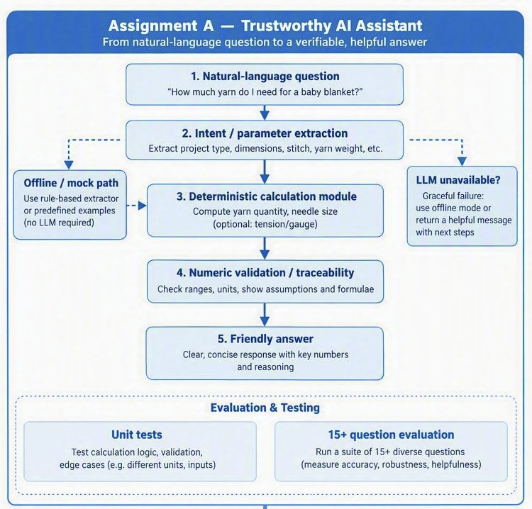
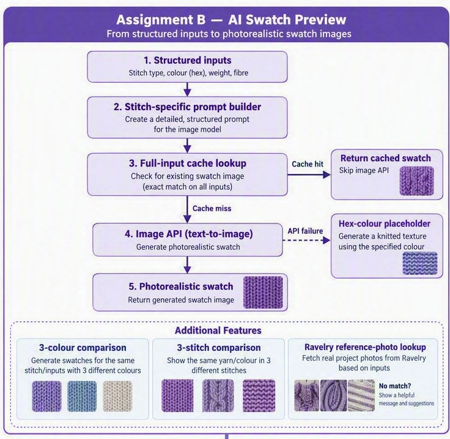

# Knitting AI Proofs of Concept (Java)

This repository contains two Java 25 command-line proofs of concept:

- `assignment-a`: deterministic knitting calculations behind a guarded
  natural-language assistant. Plain Java (no application framework).
- `assignment-b`: structured AI swatch generation with caching, visible
  fallbacks, colour/stitch comparison demos, and optional Ravelry lookup.
  Plain Java (no application framework).

Both modules use Maven and run offline without credentials. Copy `.env.example`
to `.env` only when exercising live OpenAI or Ravelry features.

## Requirements

- JDK 25
- Apache Maven 3.9+

## Build and test

From the repository root:

```powershell
mvn test
```

## Run Assignment A

```powershell
mvn -pl assignment-a compile exec:java `
  '-Dexec.args=How much DK yarn for a 50 x 60cm blanket in stockinette?'
```

For structured output, put `--json` before the question:

```powershell
mvn -pl assignment-a compile exec:java `
  '-Dexec.args=--json What needle size for worsted yarn for a balanced scarf?'
```

Without `OPENAI_API_KEY`, Assignment A uses deterministic parsing and phrasing.
With credentials, it can use the OpenAI Responses API for language understanding
and phrasing. Every displayed number is still produced by deterministic Java
calculators and checked before a provider response is accepted.

## Run Assignment B

```powershell
mvn -pl assignment-b compile exec:java
```

The offline demo deliberately triggers the deterministic Java2D fallback and
writes PNGs, cache entries, and `demo-report.json` under `artifacts`.

Live image generation:

```powershell
mvn -pl assignment-b compile exec:java '-Dexec.args=--live --output artifacts-live'
```

## Architecture

### Assignment A — Trustworthy AI Assistant



```text
Assignment A
Natural-language question
  -> optional LLM intent extraction (offline: regex parser)
  -> validate that extracted numbers occur in the question
  -> deterministic Java calculator produces every result number
  -> optional LLM phrasing (offline: template phrasing)
  -> numeric guard rejects invented or omitted numbers
```

### Assignment B — AI Swatch Preview



```text
Assignment B
Validated SwatchInput
  -> SHA-256 disk-cache lookup
  -> stitch-specific prompt
  -> image provider
  -> Java2D fallback renderer on provider failure
  -> atomic cache write + demo composition
  -> optional, independently failing Ravelry reference lookup
```

The project was migrated from Python to Java and now targets Java 25 while retaining the original
offline behavior, live-service environment variables, and test coverage.
